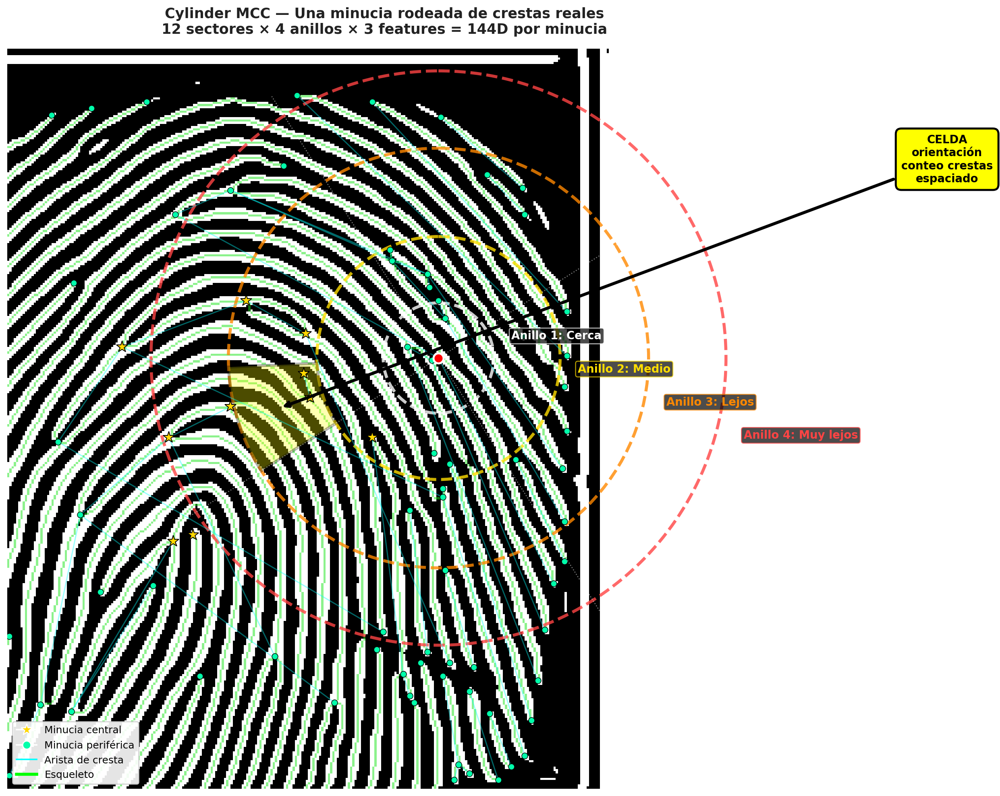
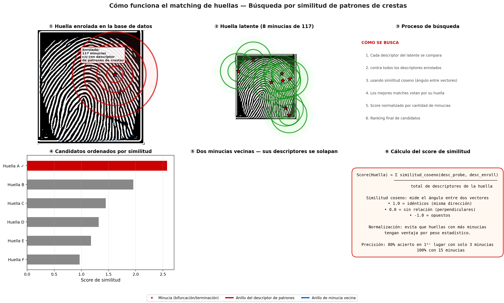
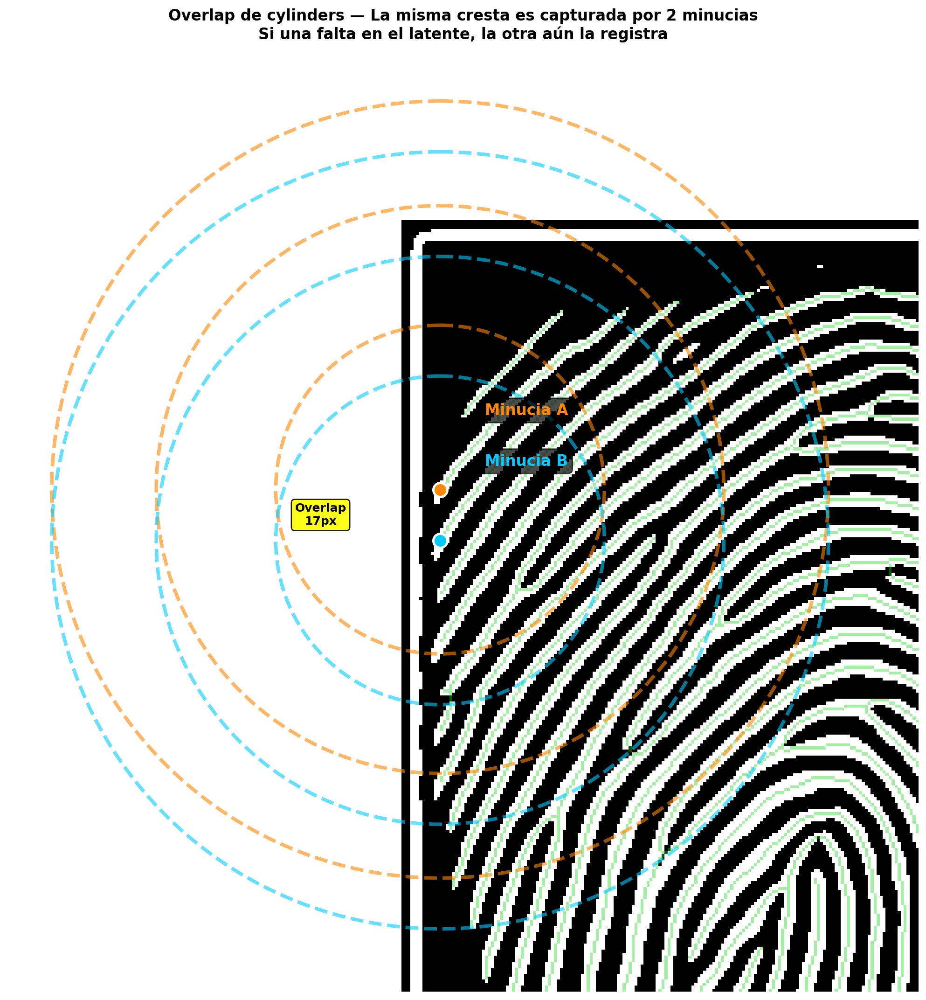
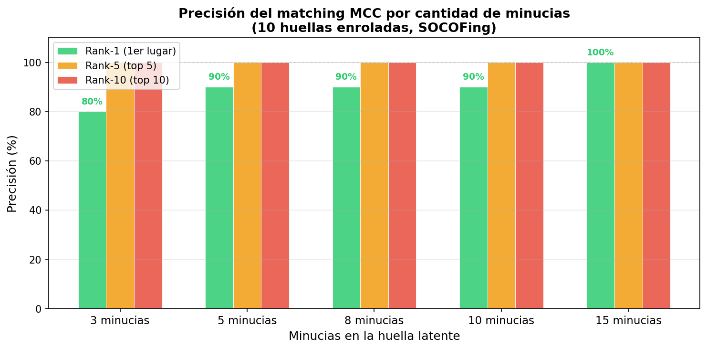

# Biometric

**Sistema AFIS Forense — Identificación de huellas dactilares para criminalística**

[](https://www.python.org/)
[](https://fastapi.tiangolo.com/)
[](https://www.postgresql.org/)
[](https://reactjs.org/)

---

## Qué hace

El perito forense sube una huella latente (levantada en escena del crimen). El sistema la procesa, extrae sus minucias, y busca en la base de datos contra huellas enroladas. Devuelve un ranking de candidatos ordenados por similitud.

**80% de acierto en primer lugar con solo 3 minucias. 100% con 15 minucias.**

## Cómo funciona el matching

```
Huella → Pipeline Gabor → Esqueleto de crestas → Minucias
          ↓
Cada minucia → Cylinder MCC (144D)
          ↓
Búsqueda: similitud coseno → votación → ranking normalizado
```

El **Cylinder MCC** captura el patrón de crestas alrededor de cada minucia. 12 sectores angulares × 4 anillos radiales × 3 features estructurales. Invariante a rotación, traslación y escala.

### Visualizaciones

| Cylinder alrededor de una minucia | Búsqueda de latente vs enroladas |
|-----------------------------------|----------------------------------|
|  |  |

| Overlap de cylinders | Precisión por minucias |
|---------------------|------------------------|
|  |  |

## Arquitectura

```
┌──────────────┐     ┌──────────────────┐     ┌─────────────┐
│  React + TS  │────▶│  FastAPI (async)  │────▶│ PostgreSQL  │
│  (Frontend)  │     │  Clean Arch       │     │ (relacional) │
└──────────────┘     │                    │     └─────────────┘
                     │  Pipeline Gabor    │     ┌─────────────┐
                     │  MCC Cylinders     │────▶│   Qdrant    │
                     │  Cosine Matching   │     │ (vectores)  │
                     └──────────────────┘     └─────────────┘
```

## Stack

| Componente | Tecnología |
|-----------|-----------|
| Backend | Python 3.12 / FastAPI (async, psycopg3) |
| Frontend | React + TypeScript + Vite |
| DB | PostgreSQL 17 |
| Vectores / Búsqueda | Qdrant + MCC Cylinders (144D) |
| Almacenamiento | MinIO |
| Auth | Argon2id + PyJWT |
| Auditoría | Hash chain inmutable |
| GenAI | LlamaIndex + Ollama / OpenAI |

## Quick Start

```bash
# 1. Dependencias
cd apps/backend
docker compose -f docker-compose.dev.yml up -d   # PostgreSQL + Qdrant + MinIO

# 2. Backend (hot reload en :8000)
uv run dev

# 3. Frontend
cd apps/frontend
pnpm install && pnpm run dev

# OpenAPI docs: http://localhost:8000/docs
```

## Estructura

```
/apps/backend    — API (FastAPI), pipeline CV, matching MCC, GenAI
/apps/frontend   — UI forense (React + TypeScript)
/.planning       — Roadmap, ADRs, fases, estado del proyecto
```
