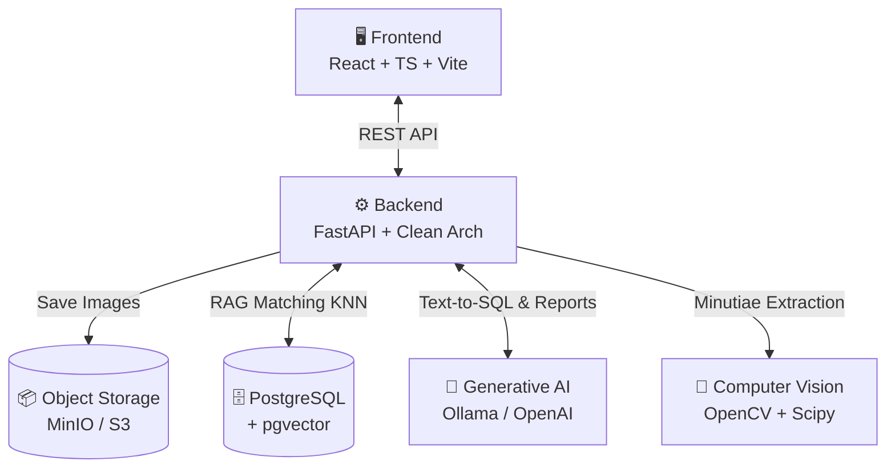
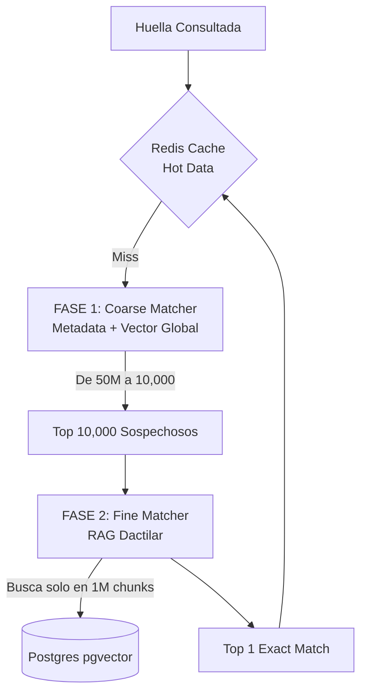

<div align="center">

# Biometric

**Next-Generation Forensic AFIS (Automated Fingerprint Identification System)**

[](https://www.python.org/)
[](https://fastapi.tiangolo.com/)
[](https://github.com/pgvector/pgvector)
[](https://reactjs.org/)

</div>

## Visión General

**Biometric** es un sistema integral para el procesamiento, registro e identificación forense de huellas dactilares. Diseñado para casos de criminalística, el sistema cruza tecnologías de **Visión Computacional Clásica**, **Motores Vectoriales (RAG)** y **Generative AI** para reducir los tiempos de identificación y automatizar la burocracia legal (Dictámenes Periciales).

### Características Principales

1. **Motor de Matching RAG Dactilar (Phase 10):**
   No busca la huella completa; utiliza triangulación de Delaunay para dividir la huella en "Local Invariant Structures". Esto permite encontrar la identidad de un sospechoso **incluso si solo se recupera un fragmento roto de la huella en la escena del crimen**.
2. **Sistema de Pesos Basados en Core:**
   Simulando el comportamiento de un perito humano, la matemática le da mayor peso probatorio a los triángulos que se encuentran cerca del centro de la huella (Core/Núcleo) y menor peso a los bordes propensos a ruido.
3. **Burocracia Cero (GenAI):**
   Generación automática de dictámenes periciales en formato PDF listos para juzgados, firmados con HMAC-SHA256, mediante integración con LLMs (Ollama/OpenAI) que procesan en lenguaje legal los findings del caso.
4. **Clean Architecture & Compliance Forense:**
   Arquitectura hexagonal pura con trazabilidad inmutable (Audit Hash Chains) y enmascaramiento dinámico de datos sensibles (PII).

---

## 🏗️ Arquitectura del Sistema



---

## 🔎 RAG Dactilar: Cómo encontramos latentes rotas

En lugar de extraer un solo vector para toda la huella, Biometric extrae múltiples "Párrafos" (Triángulos), como en un sistema RAG de texto.

```mermaid
graph LR
    Latent[Fragmento Latente\n>=2 Minucias] --> Extractor[Skeleton Extractor\nGabor Filters]
    Extractor --> Minutiae((Puntos Minucias))
    Minutiae --> Delaunay[Triangulación\nde Delaunay]
    
    Delaunay --> Triplet1[Triángulo 1\nPeso: 0.9]
    Delaunay --> Triplet2[Triángulo 2\nPeso: 0.2]
    
    Triplet1 --> HNSW[Búsqueda en pgvector\nCosine Distance]
    Triplet2 --> HNSW
    
    HNSW --> Agg[Suma: (Similitud × Peso)]
    Agg --> Match[🏆 Match Exacto]
```

---

## 🚀 Escalamiento a Nivel Nacional (50M+ Huellas)

Para escalar a 5 millones de habitantes (50 millones de dedos = **5 Billones de Triángulos**), la arquitectura evoluciona a un **Embudo Coarse-to-Fine con Caching**:



---

## Estructura del Repositorio

- `/apps/backend`: Motor en Python (FastAPI). Visión computacional, RAG vectorizer, Generative AI, SQLite/Postgres.
- `/apps/frontend`: UI para los peritos criminalistas en React + TypeScript.
- `/.planning`: Documentación de fases, roadmaps, ADRs (Architecture Decision Records) y el estado del proyecto.

## Ejecución Local

1. Levantar dependencias base de datos y cache (si aplica):
   ```bash
   cd apps/backend
   docker compose -f docker-compose.gpu.yml up -d
   ```
2. Ejecutar el backend:
   ```bash
   cd apps/backend
   uvicorn src.main:app --reload
   ```
3. Ejecutar el frontend:
   ```bash
   cd apps/frontend
   npm install
   npm run dev
   ```
