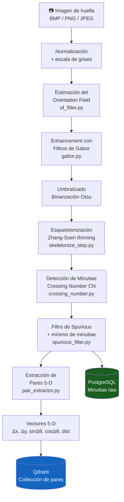
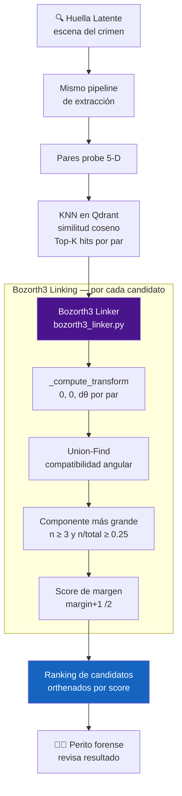
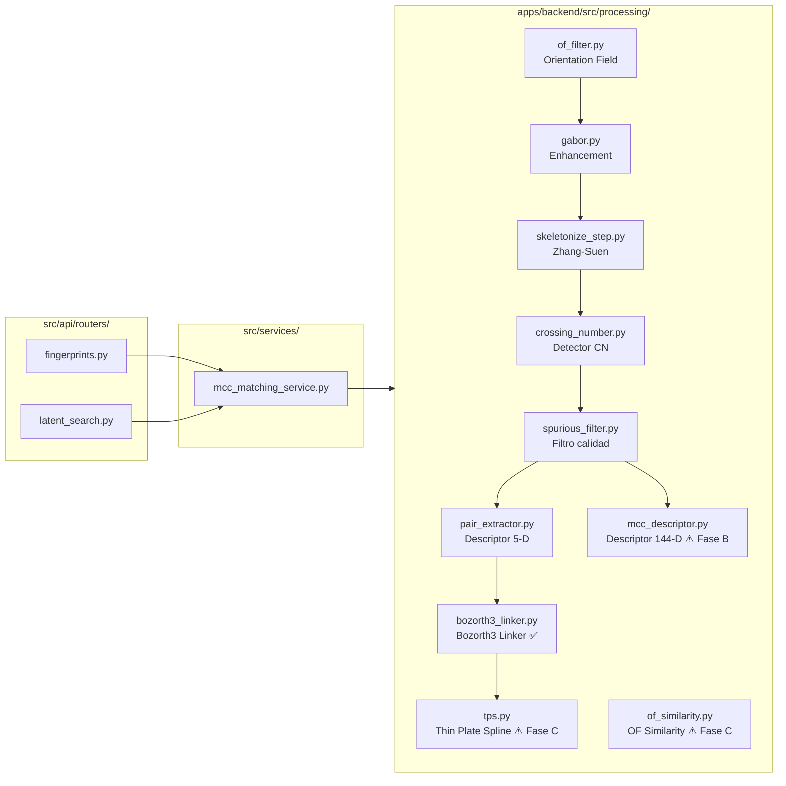
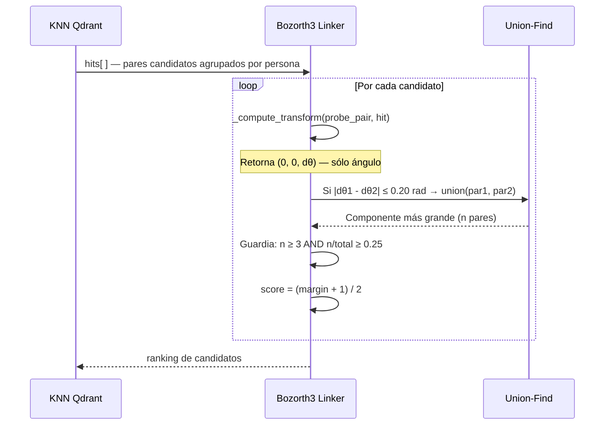

# Flujo del Pipeline Biométrico

Descripción del flujo de procesamiento actual del sistema AFIS Forense.

> Última actualización: Junio 2026 (Fase A — Bozorth3 linker corregido)
> Ver base científica completa en [`FINGERPRINT_SCIENCE.md`](./FINGERPRINT_SCIENCE.md)

---

## Flujo completo: Enrolamiento

---

## Flujo completo: Búsqueda de huella latente

---

## Diagrama de módulos y responsabilidades

---

## Invarianza a rotación: cómo funciona el Bozorth3

---

## Comparación: descriptor actual vs Fase B

| Aspecto | Descriptor 5-D (actual) | MCC 144-D (Fase B) |
|---------|------------------------|--------------------|
| Dimensionalidad | 5 | 144 |
| Unidad | Par de minutiae | Minutia individual |
| Invarianza | Parcial (relativa al par) | Total (rotación + traslación) |
| Colisiones en KNN | Alta (geometrías comunes) | Muy baja |
| EER en FVC2006 | ~8–10% estimado | 1.82% (Cappelli 2010) |
| Estado | ⚠️ En uso, deprecar Fase B | ✅ Implementado, conectar |

---

## Estado de fases

| Fase | Descripción | Estado |
|------|-------------|--------|
| **A** | Bozorth3 linker corregido (rotation-only + component guards) | ✅ Completa |
| **B** | Migrar descriptor 5-D → MCC 144-D | 🕒 Pendiente |
| **C** | TPS post-match + OF Similarity en scoring | 🕒 Pendiente |

Ver detalles técnicos y base científica en [`FINGERPRINT_SCIENCE.md`](./FINGERPRINT_SCIENCE.md).
